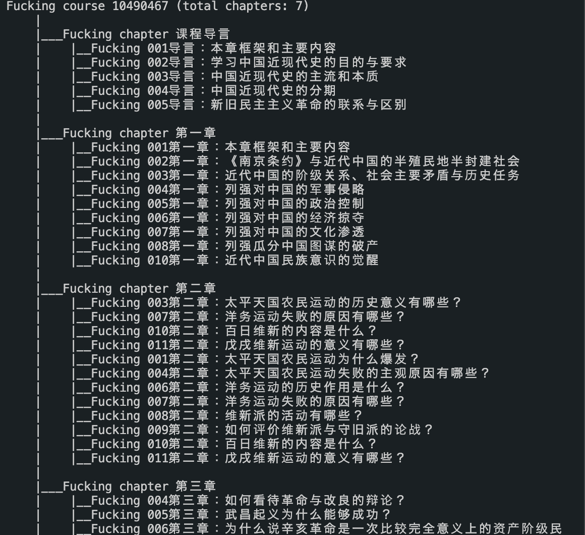
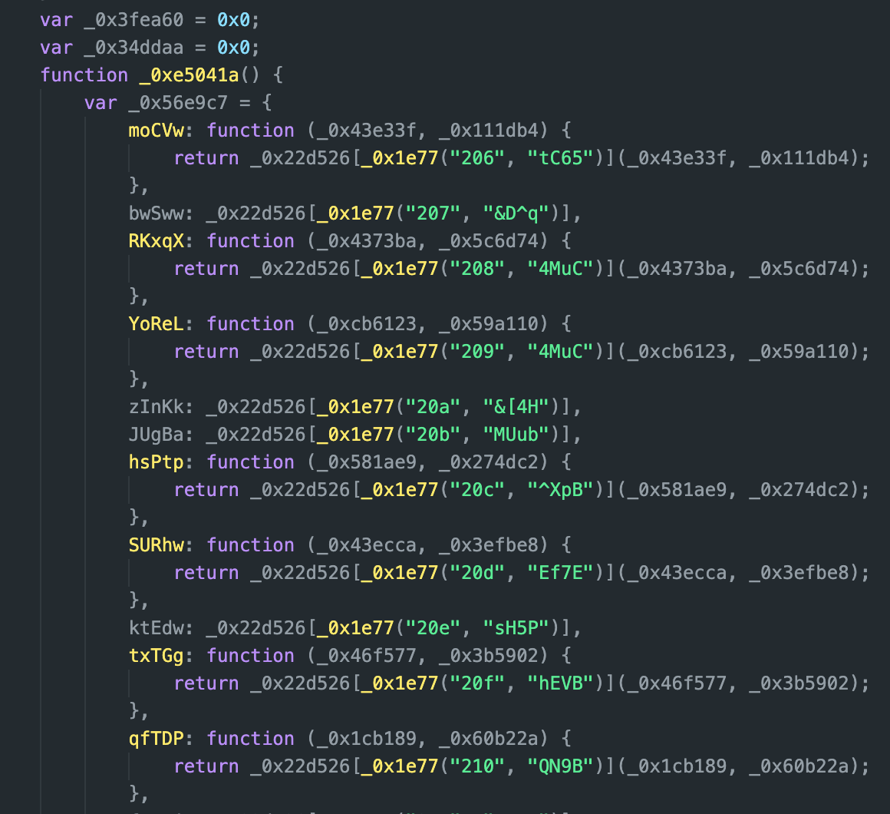
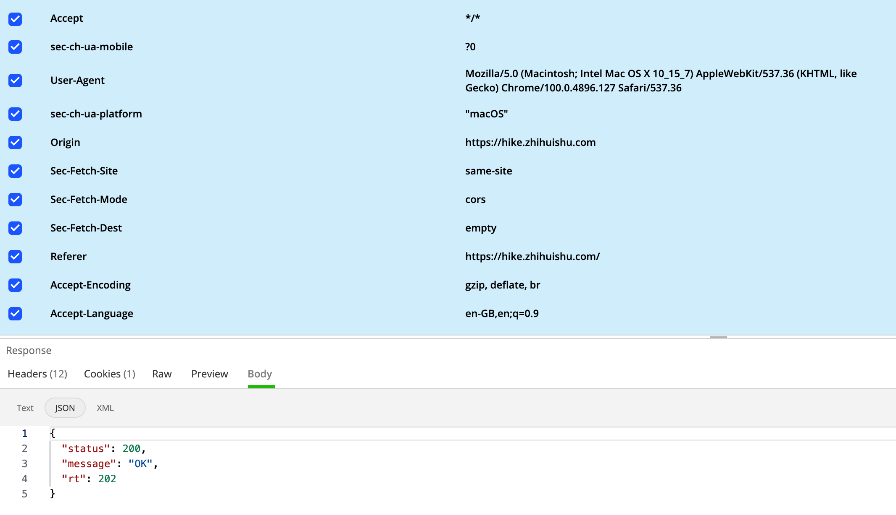
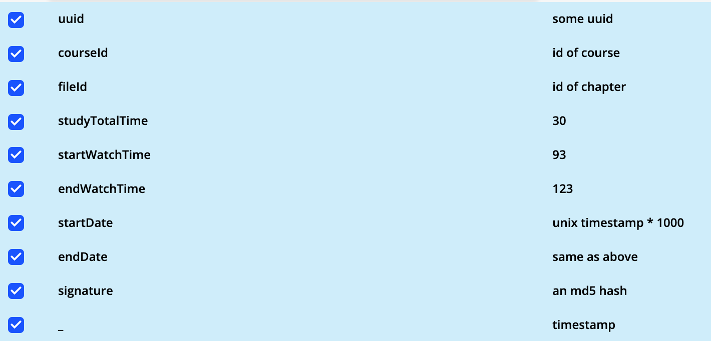
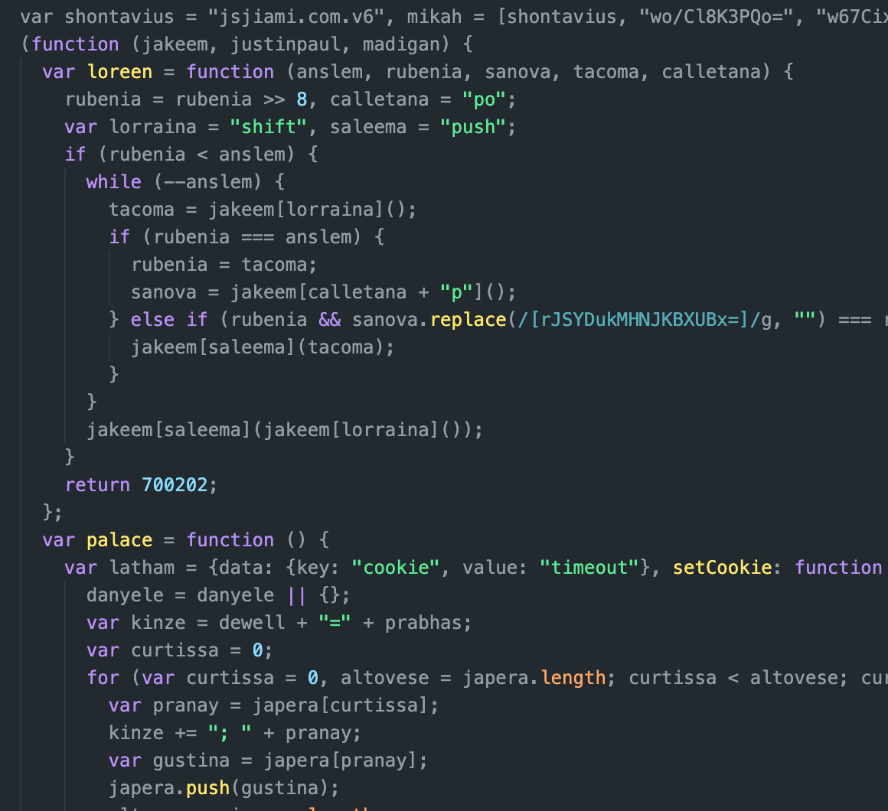
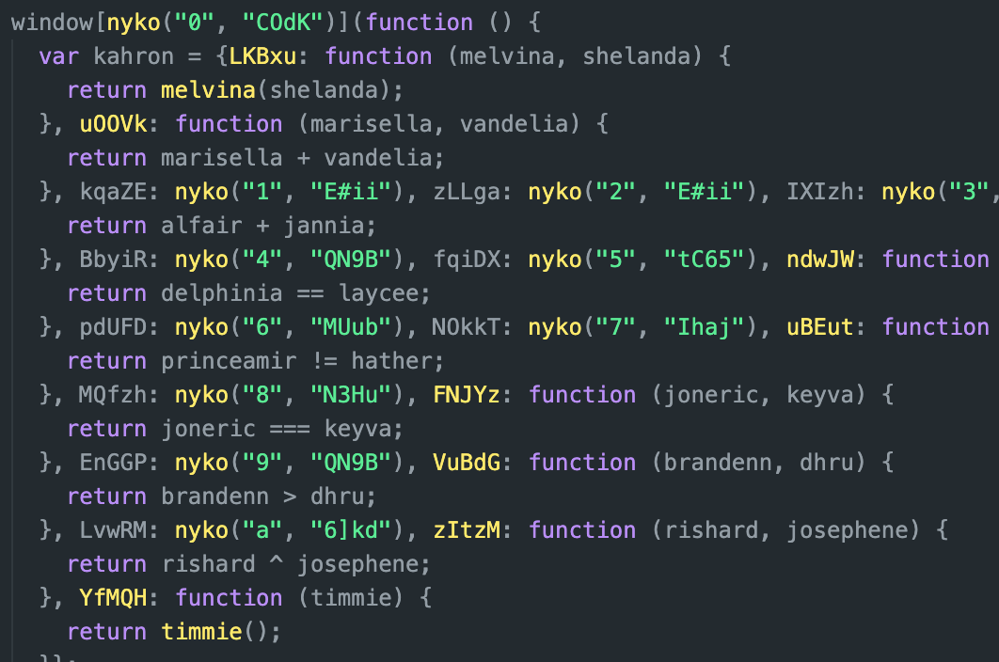
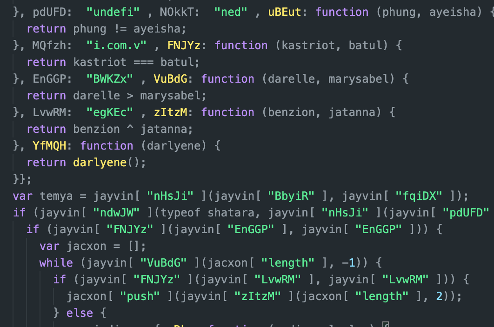
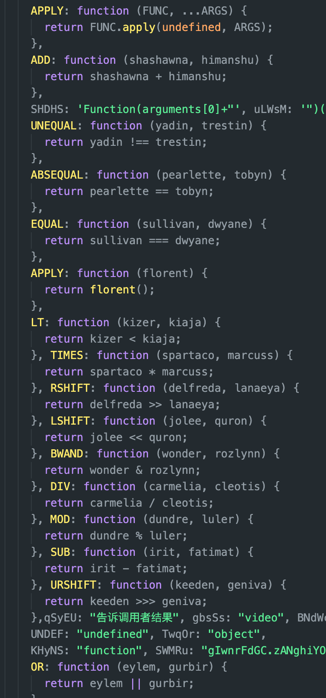
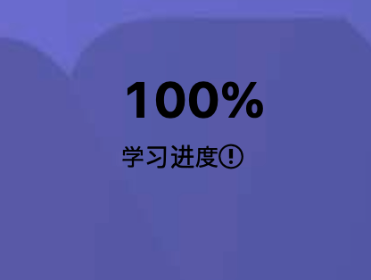

## ZHS Fucker 食用指北

### WTF?
这是一个 _Python3_ 的自动脚本, 用于自动刷智慧树课堂课程, 为您节约有限的生命.

**Features**
* 支持校内学分课与知到共享学分课
* 自动回答弹题
* 设定时限
* 射后不管, 无需交互
***
### WHY?
自从智慧树的校内学分课(i.e. hike)播放页面用了个窒息的 _JavaScript_ 混淆之后, 大部分前端的脚本都没法用了.  
因为它会检查 _DevTools_ 是否打开, 如果打开了就无法继续运行, 要分析的话由于混淆, 解读很麻烦.  
于是我打算直接抄家, 入它后端(*), 之后便有了该脚本. (虽然最后还是被逼着反混淆了前端代码...)  
***
### 重要更新
-> v2.3.0:
1. 新增二维码登陆, 当前版本强制启用(由于登陆验证改变, 目前账号密码登陆失效) 详见[Login](#Login)
2. 新增依赖 _websockets_
3. 新增依赖 _Pillow_

-> v2.2.0:
1. 课程 ID 不再为必须参数
2. 支持从文件读取课程枪毙清单, 详见 [_拉清单_](#拉清单)  

-> v2.0.0:
1. 新增 知到共享学分课 API(studyservice-api) 的支持, 参考了 [luoyily](https://github.com/luoyily/zhihuishu-tool) 与 [zhixiaobai](https://github.com/zhixiaobai/Python-zhihuishu) 的 repo
2. 移除依赖 _selenium_
3. 新增依赖 _pycryptodome_
***
### 准备工作
您需要准备以下东西
* _Python3.10_ 及以上版本(或自行改写旧版不兼容的语法)
* _requests_ 
* _pycryptodome_ 或其等价替代
* _websockets_
* _Pillow>=8.1.1_

执行 `pip install -r requirements.txt` 即可安装依赖
***
### 如何使用

本块分为

0. Ultra Quick Start: 执行 `python main.py`
   * 仅以交互输入信息, 除非开 DEBUG 模式否则不留任何敏感记录

1. `Login`: 输入账号与密码
   * 使用配置文件
   * 使用命令行参数

2. `Fxxking`: 开干
   * 使用命令行参数
   * 拉清单
   * 参数列表

3. `API` 简易文档: 用于单独使用模块

#### Login
  _*如果非常用地登入会需要短信验证, 您应该先用浏览器登入一次, 以让您的所在地列入白名单._  
  _**信息优先级: 命令行 > 配置文件 > 交互输入_  
##### 使用配置文件:  
配置文件 _config.json_ 中有以下字段:
```JSON
{
  "username": "",
  "password": "",
  "qrlogin": true,
  "proxies": {},
  "logLevel": "INFO",
  "qr_extra": {
        "show_in_terminal": false,
        "char_width": 2,
        "ensure_unicode": false
    }
}
```
* `username`: 账号 
* `password`: 密码
* `qrlogin`: 启用二维码登陆, 方便在服务器上部署, 优先级高于账号密码
* `proxies`: 代理, 可留空, 在 _Windows_ 上还可解决 _Clash_ 等代理造成的证书错误, 详见 [_常见问题_](#常见问题)
* `logLevel`: 日志等级, 可选 `NOTSET` `DEBUG` `INFO` `WARNING` `ERROR` `CRITICAL` 
* `qr_extra`: QR 相关配置
   * `show_in_terminal`: 将二维码打印至终端
   * `ensure_unicode`: 仅使用 Unicode 字符打印二维码
   * `char_width`: 设置 `ensure_unicode` 为真时的字符宽度  
   
~填入账号密码即可无干预自动登入~ 当前失效  
 _*配置文件如果没有的话会在 main.py 执行时自动创建._   

##### 使用命令行参数登入:
```bash
python main.py -u <username> -p <password>
python main.py -q
```
* `-u` `--username`: 账号
* `-p` `--password`: 密码, 要注意密码将会明文留在记录中, 故不推荐使用 `-p` _*虽然说这破站密码泄漏就泄露吧, 写配置文件里多方便, 俗话说晚泄不如早泄(¿)_  
* `-q` `--qrlogin` : 启用二维码登陆  

***
#### Fxxking
##### 命令行指北:  
**以下假设您已经在配置文件中输入必要信息**  
  _*信息优先级: 命令行 > 配置文件 > 交互输入_  
```bash
cd fuckZHS
python main.py # 刷所有课
# 只刷课程 ID 为 114514 的课
python main.py -c 114514
# 想秒过可以设个很高的 SPEEEED
python main.py -s 444 # 我就感觉到快, 有种催人ban的感觉
# 又或者可以限制每节课学习25分钟
python main.py -c 114514 -l 25
# 遇到问题想开 debug 模式, 顺带加个代理?
python main.py -c 114514 -d --proxy http://127.0.0.1:2333
# 又比如您想只干某几个视频, 那您可以使用 -v 传入视频 ID
python main.py -c 114514 -v 4060 9891
```
什么？不知道课程 ID 或视频 ID? 进入课程界面就可以在网址里看到了.  
  _*课程 ID 为网址中的 `courseId`(校内学分课) 或 `recruitAndCourseId`(共享学分课) 参数_  
  _**更多选项请使用 `-h` 查看._  

##### 拉清单:
使用 `--fetch` 参数可从服务器获得所有课程清单, 存储到 _execution.json_ 这个小本本里, 您可以删去不想干的课程  
当该文件存在且没有指定课程 ID 时, 会先看看这个小本本上有没有写着课程 ID  
_*清单中 `id` 参数是必须的, 想额外拉清单时请注意_  
_**修改时请注意 JSON 语法, 不然 Exceptions 会一下突开到脸上_
```bash
python main.py --fetch
```
清单示例:
```JSON
[
    {
        "name": "中国近现代史",
        "id": "42"
    },
    {
        "name": "思想道德与法治",
        "id": "1919"
    }
]
```
##### 命令行参数列表:
* `-c`, `--course`: 课程 ID, `courseId` 或 `recruitAndCourseId`, 可输入多个
* `-v`, `--videos`: 视频 ID, `fileId` 或 `videoId`, 可输入多个
* `-u`, `--username`: 账号
* `-p`, `--password`: 密码
* `-q`, `--qrlogin`: 
* `-s`, `--speed`: ~~**POWERR AND SPEEEEED!**~~ 指定播放速度, 想要秒过可以设个很高的值(e.g. 644), 但不推荐. 默认为浏览器观看能到的最大值
* `-t`, `--threshold`: 完成时播放百分比, 高于该值视作完成
* `-l`, `--limit`: 单节课的时限, 如果您看得上内点习惯分就用吧
* `-d`, `--debug`: 调试级日志记录, 会记录请求到日志 ***(可能包含账号密码, 别乱分享, 当心被盒武)***
* `-f`, `--fetch`: 获取课程清单并存入 _execution.json_ 文件
* `--show_in_terminal`: 将二维码打印至终端
* `qr_char_width`: 设置 `ensure_unicode` 为真时的字符宽度
* `qr_ensure_unicode`: 设置 `ensure_unicode` 仅使用 Unicode 字符打印二维码
* `--proxy`: 代理设置, 本来用来调试的(e.g. http://127.0.0.1:8080)
* `-h` `--help`: 显示帮助

运行示例如下:
  
***
#### 常见问题
* 登入失败
  * 检查您的账号密码是否有误
  * 先用浏览器登入一次看看, 可能您的 IP 地址被认为是异地了, 需要短信验证
  * 解决 SSL 证书错误, 见下文
* 请求响应: -12 "需要滑块验证" (触发原因不明)
  * 浏览器登入后手动过一次验证
  * 降低单次学习的时间
  * 本脚本会随机暂停一分钟以缓解这个问题, 您可以在源码中增加概率
* 请求响应: -1 "无法处理请求"
  * 某些请求被认为内容不合法了, 因为我测试例很少, 可能有些特例覆盖不全, 请把错误日志贴上, 开个 issue, 我尽力解决
* 语法错误
  * 喂, 伙计, _Python_ 版本对了没?
* SSL证书错误, _Windows_ 上开着 _Clash_ 之类的代理可能会报证书错误
  * 直接关闭系统代理
  * 将 _Clash_ 改为 TUN 模式, 且关闭系统代理, 相当于改成透明代理, 不影响上网 ***(推荐)***
  * 配置文件中编辑 `"proxies":{"https":""}`
* 还是无法解决?
  * 建议先开启 DEBUG 模式, 自行查看报错信息, 如果确实是我的锅就劳烦开个 issue
  * 解决提出问题的人 ***(推荐)***  
  ***JUST DO IT!***  
    

指北就这些啦, ~~代码很少可以自己看~~ 现在不少了().
***
#### `API` 简介
详见源码
###### 实例化 `Fucker`:  
```Python
from fucker import Fucker

fucker = Fucker()
# 或者更进阶一些
fucker = Fucker(speed=1.5, end_thre=0.91)
# 以上控制播放速度以及终止临界值
# speed: 校内学分课播放速度正常最高为1.25, 共享学分课为1.5, 但似乎更高的服务器也接受, 不过怕暴露就谨慎些吧
# end_thre: 智慧树把高于一定百分比的进度视为完成, 0.91 保险一点
# 以上俩参数仅对视频有效, 其他的内容就只有进度0或1
```
##### `login` Method:
如果您能自己得到 `Cookies` 就可以略过, 直接给 `Fucker` 实例的 `cookies` 属性赋值即可
_Python3_ 登入样例
```Python
fucker.login(username:str, password:str)
fucker.login(username:str, password:str, interactive=False) # 禁用交互, 在账号或密码为空时引发异常

# 如果您不想使用 login
# 也可直接传入符合 requests 库要求的 cookies
fucker.cookies = {key: "Angel Beats!", "inside Uncle's eyes": value}
# 该 cookies 会覆盖原有值, 同时请确保它是完整的智慧树 cookies，因为 uuid 需要从 cookies 中解析
```
##### `fuckCourse` Methods Family:  
```Python
fucker.fuckCourse(course_id:str) # 把整个课程都干了
fucker.fuckCourse(course_id:str, tree_view=False) # 把整个课程都干了, 但不显示树状视图
fucker.fuckZhidaoCourse(recruitAndCourseId) # 点名就要干知到共享学分课
fucker.fuckHikeCourse(courseId) # 点名就要干校内学分课(hike)
```
##### `fuckVideo` Methods Family:
```Python
fucker.fuckVideo(course_id, video_id) # 指定干某节课里某视频
fucker.fuckZhidaoVideo(recruitAndCourseId, videoId) # 这里的 videoId 是从 网页API响应 中获得的
fucker.fuckHikeVideo(courseId, fileId) # 这俩就在 校内学分课(hike) 网址里
```
##### `getContext` Methods Family:
```Python
fucker.getZhidaoContext(recruitAndCourseId)
fucker.getHikeContext(courseId)
fucker.getHikeContext(courseId, force=True) # 强制更新context并重置课程学习时间(本地记录)
'''
自动在 `fuck*Course` `fuck*Video` 中被调用  
返回一个 `dict`, 内含该 ID 对应课程的必要信息以及实例运行后学习该课的总时间, 必要信息没有的话会向服务器请求 
该 `dict` 结构请见源码
'''
```

##### `hike` API:
```Python
# 自动添加时间戳和签名, 并检查返回代码
def hikeQuery(self, url:str, data:dict,sig:bool=False, ok_code:int=200, setTimeStamp:bool=True, method:str="GET")...
# 以下为与网页接口同名的 API, 只返回响应中的 "rt" 部分
def queryResourceMenuTree(self, course_id)...
def stuViewFile(self, course_id, file_id)...
def saveStuStudyRecord(self, course_id, file_id, played_time, prev_time, start_date)...
```
##### `zhidao` API:
```Python
# 自动添加时间戳和加密, 并检查返回代码
def zhidaoQuery(self, url:str, data:dict, encrypt:bool=True, ok_code:int=0, setTimeStamp:bool=True, method:str="POST", key=VIDEO_KEY)...
# 以下为与网页接口同名的 API, 只返回响应中的 "data" 部分
def gologin(self, RAC_id)...
def queryCourse(self, RAC_id)...
def videoList(self, RAC_id)...
def queryStudyReadBefore(self, course_id, recruit_id)...
def queryStudyInfo(self, lesson_ids:list, video_ids:list, recruit_id)...
def queryUserRecruitIdLastVideoId(self, recruit_id)...
def prelearningNote(self, RAC_id, video_id)...
def loadVideoPointerInfo(self, RAC_id, video_id)...
def lessonPopoupExam(self, RAC_id, video_id, question_ids:list)...
def saveLessonPopupExamSaveAnswer(self, RAC_id, video_id, question_id, answer_ids:str)...
def saveDatabaseIntervalTime(self, RAC_id, video_id, played_time, last_submit, watch_point, token_id=None)...
def saveCacheIntervalTime(self, RAC_id, video_id, played_time, last_submit, watch_point, token_id=None)
```

***
### 结构介绍
#### 文件结构:
* main.py: 命令行主函数
* sign.py: 负责生成 hike API 所需的 `signature` 参数
* utils.py: 一些常用工具
* logger.py: 日志工具, 将不同等级的日志写入不同文件
* fucker.py: `Fucker` 类定义, 所有核心代码全塞一起了, 莫在意
* ObjDict.py: `ObjDict` 类定义, 继承自 `dict`, 可以 `object` 属性形式访问 `dict`
* zd_utils.py: 知到 API 所需的工具, 如生成 `ev` 和 `secretStr`  
* config.json: 还能是啥, 没有的话初次运行 _main.py_ 时将生成
* meta.json: 包含版本和分支等信息, 也用于更新检查
* decrypt: 非必要的文件夹, 内含逆向源代码的工具及源码打包
#### Fucker Class Structure:  
```Python
class Fucker:
    def __init__(self, cookies: dict = None,
                 headers: dict = None,
                 proxies: dict = None,
                 limit: int = 0,
                 speed: float = None,
                 end_thre: float = None)...

    @property # cannot directly manipulate _cookies property, we need to parse uuid from cookies
    def cookies(self)...
    @cookies.setter
    def cookies(self, cookies: dict|requests.cookies.RequestsCookieJar)...

    def login(self, username: str=None, password: str=None, interactive: bool=True)...
    def fuckCourse(self, course_id:str, tree_view:bool=True)...
    def fuckVideo(self, course_id, video_id:str)...
#############################################
# for some fucking reasons
# there are 2 sets of completely different API for hike.zhihuishu.com and studyservice-api.zhihuishu.com
# so we need to use different methods for different API
#############################################
# following are methods for studyservice-api.zhihuishu.com API
    def getZhidaoContext(self, RAC_id:str, force:bool=False)... 
    def fuckZhidaoCourse(self, RAC_id:str, tree_view:bool=True)...
    def fuckZhidaoVideo(self, RAC_id, video_id)...
    def answerZhidao(self, q:dict)...
    def _zhidaoQuery(self, url:str, data:dict, encrypt:bool=True, ok_code:int=0,
               setTimeStamp:bool=True, method:str="POST")...
# end of zhidao methods
#############################################
# following are methods for hike API
    def getHikeContext(self, course_id:str, force:bool=False)...
    def fuckHikeCourse(self, course_id:str, tree_view:bool=True)...
    def fuckHikeVideo(self, course_id, file_id, prev_time=0)...
    def fuckFile(self, course_id, file_id)...
    def _traverse(self,course_id, node: ObjDict, depth=0, tree_view=True)...
    def _hikeQuery(self, url:str, data:dict,sig:bool=False, ok_code:int=200,
                   setTimeStamp:bool=True, method:str="GET")...
# end of hike methods
#######################################
# shared private methods
    def _watchVideo(self, video_id)... # it's probably unnecessary but let's keep it to fool those idiots
    def _apiQuery(self, url:str, data:dict, method:str="POST")...
    def _checkCookies(self)...
    def _checkTimeLimit(self, cid)...
    def _sessionReady(self, ctx:dict=None)...
```
我的很大, 你忍一下(指类定义)
***
## 后记
这一段算是授之以渔吧, 毕竟网站以后更新可能会改内容, 我又没时间更新, 就先把思路写在这. 但要注意, 下文提到的混淆肯定引入了随机量, 不可完全照搬该思路.  
过程中用到的文件样本大多都在 _decrypt_ 目录下压缩档里.

***以下内容仅针对校内学分课的 `API` ("hike" 开头的域名)***

### chapter 0: Too Young Too Naive
本以为从后端入手会很轻松, 目前绝大部分的脚本是在前端实现刷智慧树自动化(有例外但那些都不是对付校内学分课的), 这样做不仅鲁棒性很差而且过于复杂, 本脚本则直接绕后, 甩开前端, 可以做到不变应万变...吧?

#### 捉包:
总之先捉个包看看前端怎么和服务器交流, 没想到一开浏览器开发者模式就遇到了问题.  
一旦监测到 _DevTools_, 网页界面就立即停止响应.  
但这还不简单, 手动把相关 _JavaScript_ 无脑删不就行, 源码都在我手上有什么好怕的.

紧接着一看源码:


_好家伙《乱码1/2》_

不过这也没什么, 我本来就只是想抓个包, 用别的工具就是了.

抓包得到页面向服务器报告进度的甜言蜜语:  
`Headers`:


`Params`:

_*敏感信息被替换了_  
您看看这些人多不专业, 拿 `GET` 干 `POST` 的活, 而且那个 `uuid` 根本就不是真的 UUID, 七八个随机字符而已.  

#### 模拟请求:
不过我们一路顺风, 成功就在眼前(flag++).  
这时可以看到一个正常的响应是:
```JSON
{
  "status": 200,
  "message": "OK",
  "rt": 202
}
```
`rt` 是服务器返回的观看进度.

包里大部分参数都很直接, 我们照搬便是.  
`courseId` 我们可以从浏览器链接里得知,  
`fileId` 每个章节的都不一样, 可以从“https://studyresources.zhihuishu.com/studyResources/stuResouce/queryResourceMenuTree” 中获取的JSON 中得到, 源码里有, 不再赘述.

剩下只有 `signature` 不明, 不过大概是个防止多次提交的随机字符串罢了, 毕竟这群人取名似乎一直不太准确.

然后一试
```JSON
{
  "status": 200,
  "message": "OK",
  "rt": null
}
```
**???**  
为何就返回个 `null`, 为了解决这个问题我快把浏览器内核用 _Python_ 实现了, 一直以为就是个 `Headers` 或者 `Cookie☆` 的问题, 我可能缺了什么.  
结果最后才发现问题在 `Params`, 而且就是里面那个该死的 `signature` 造成的.  
这次他们取对名字了, 这真是个签名, 必须和其他内容配套才能被视作合法请求, 并得到 `rt`.  
想要自己生成这个 `MD5` 签名就只能从前端代码里找 salt 等数据.

没办法, 开始人生第一次反混淆 _JavaScript_ 吧...
***
### chapter 1: At Beginning, It's Just Chaos
下图开头这个站点名就是万恶之源了, 话说为什么叫“加密”, 只是混淆而已, 和加密相差太远了, 只能说连名字都取的很 Obfuscated.

首先得把这些诡异变量重命名一下, 在 [_这个站点_](https://deobfuscate.io) 可以初步反混淆, 去掉一些简单的函数 wrapping 并重命名变量, 新变量名当然是随机的, 只是好读一些.

#### 初步反混淆:

这下好多了, 我们可以看 ***不*** 到开头有一行超大的列表(太长了就只截了前几个), 不过它大概有 1.4k 个**字符串**,  
看起来是 Base64, 解码后是乱码, 是被加密了(真·加密).

再观察一下可以发现一个函数出现的次数很多:

这个 nyko 便是负责解密的函数.

要反混淆 nyko 就需要手动去掉一堆无用的循环和分支, 不然真读不下去.  
恶心的是这个混淆后版本里充斥着各种看起来有意义的字符串, 甚至有些就是混淆前代码里的, 但他们被拿来进行无意义的比较和循环, 这样做可以同时迷惑您和您的 CPU.

总之反混淆出来是这样一个简单的解密程式, 用 _Python_ 重新实现了:
```Python
def decrypt(index:str, key:str):
    index = int(index, 16)
    encrypted = b64dec(table[index])
    key = key.encode()

    mod_sum = 0
    ar = list(range(256))
    for i in range(256):
        mod_sum = (mod_sum + ar[i] + key[i % len(key)]) % 256
        ar[i], ar[mod_sum] = ar[mod_sum], ar[i]
    mod_sum = 0
    n = 0
    decrypted = ""
    encrypted = encrypted.decode()
    for i in range(len(encrypted)):
        n = (n + 1) % 256
        mod_sum = (mod_sum + ar[n]) % 256
        ar[mod_sum], ar[n] = ar[n], ar[mod_sum]
        decrypted += chr(ord(encrypted[i]) ^ ar[(ar[mod_sum] + ar[n]) % 256])
    return decrypted
```

_JavaScript_ 原版其实在 Base64 解码后, 还有个手动把内容 URLEncode 了, 又调用 `decodeURIComponent` 解码的诡异操作.  
一开始我把它删了, 结果竟然生成内容不一样. 似乎是 _JavaScript_ 的 `atob` 似乎会保留非法的内容? 经过看似无意义的 URL Encode&Decode 会把这些字符丢弃掉, 只能说混淆者真是钻研了折磨人的极致了, 好在 _Python_ 的 `b64decode` 默认丢弃这些内容. _*此部分存疑, 不确定原因是不是这个_

接下来尝试对列表内容解密, 发现还是乱码...

没办法, 只得继续化简开头的函数, 看看会有什么线索.  
接着发现程式开头有一段循环, 把列表开头和结尾的俩无意义的东西扔了, 顺带把这个列表旋转了138位, 用 _Python_ 表示就是 `deque.rotate(-138)`  
这个值是好像是固定的, 但保不准以后会变   

#### 解读解密后代码:
解密并替换内容后的文件:


解密之后常量已经可以看到了, 但其中仍有很多垃圾信息.  
比如其中有类模式, 就是混淆版本会在一个 `Object` 内包装一堆简单的函数, 比如加减和比较, 然后取个无意义的名字.  
结合那一堆无意义的变量来做比较判断, 以此来表示单个 `Boolean` 值.  
因为嵌套的次数太多所以自动反混淆没能解决它们, 但只要搞清这点可以手动去掉很多无意义的分支.
```JavaScript
var Wtf = {
       RvuT: function (dyo, bie){
       return dyo === bie;
       },
       oPhT: function(Jely, Inp, Stb){
       return Jely(Inp, Stb)
       },
       stEbU: "d0gky", RlVDj: "rk8Eb"
    }
if (Wtf.oPhT(Wtf.RvuT,Wtf.stEbU,Wtf.RlVDj){
    console.log("WTF");
    }
    
//以上这一大坨， 也就等价于
if (false){
  console.log("who cares what I've logged");
  }
  
//也就等价于
//do fucking nothing but consuming your CPU, storage, network bandwidth and god damn time
  
```
***
### chapter 2: Let There = Light
总算看见曙光了, 但要继续解读的话, 这些乱码的函数名字太难读了, 以功能来重新命名吧, 顺便去掉无用的, 重复的部分:



怎么说呢, 虽然是很繁琐的一件事, 但看着大批大批代码被删有种莫名的快感, 我当游戏玩了一久.

玩得差不多的时候突然想起来我好像不必把所有代码反混淆, 找到 `MD5` 相关的代码就好啊.  
现在代码也只有一千多行了, 挺好找的才是.  
随手一翻发现:
```JavaScript
function jobany(params) {
      var lennora = kenshin.ADD(kenshin.ADD(
        kenshin.ADD(kenshin.ADD(kenshin.ADD(
          kenshin.ADD(kenshin.ADD(kenshin.ADD(
            kenshin.ADD("o6xpt3b#Qy$Z", params.uuid
          ), params.courseId),  params.fileId
        ), params.studyTotalTime),  params.startDate
      ), params.endDate),  params.endWatchTime
    ), params.startWatchTime),  params.uuid);
      console.log(lennora);
      return kenshin.APPLY($md5, lennora);
    }
```
~~_"Here↘ comes ↗Jobany~"_~~  
诶嘿, 改函数名有效果了, 是**盐**! 它加了**盐**! (顺带特想吐槽下这个自动生成的对象名 `kenshin`，挺中二)

**盐**(bushi):

***
### chapter 3: small step, Giant Leap
为了个区区 `signature` 废了好大功夫  
不过有了这个我们可以自己签名了, 没想到人都这么大了还靠在自己作业上签名来骗人
```Python
from hashlib import md5
from ObjDict import ObjDict # 这是一个我从 dict 继承后魔改的玩意儿，可以用 JavaScript 风格访问 dict

SALT = "o6xpt3b#Qy$Z"

def sign(p:dict):
    p = ObjDict(p)
    raw = SALT + p.uuid + p.courseId + p.fileId + p.studyTotalTime + \
           p.startDate + p.endDate + p.endWatchTime + p.startWatchTime + p.uuid
    return md5(raw.encode()).hexdigest()
```

我们也算是**努力**的**靠自己**完成作业了

  
~~_已经1000%了()_~~  
***
给把如此凌乱的内容看到最后您一些安慰吧  
祝您学习像 Anya 一样好, 料理如 Yor 一般出色!

(sauce: Pixiv; pid:[97128620](https://www.pixiv.net/en/artworks/97128620)) ***放 GitHub 仓库不能算转载吧?***
